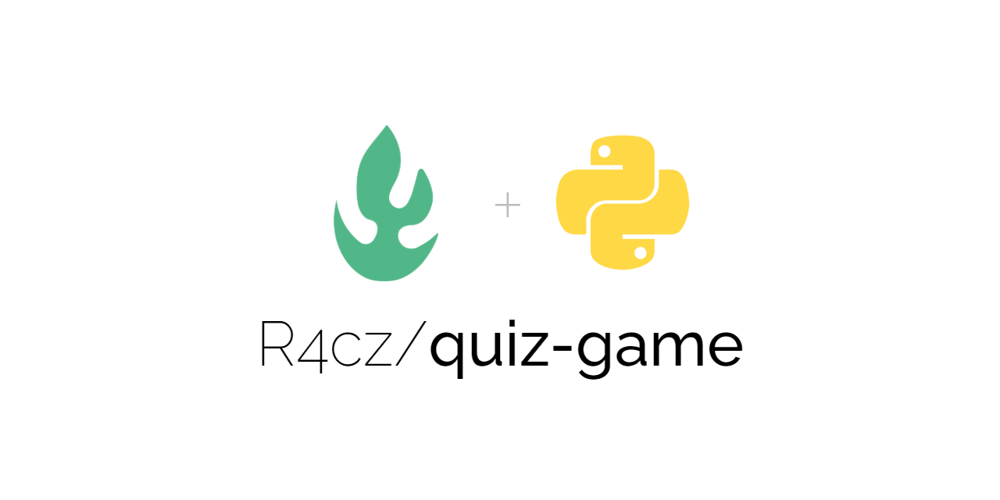
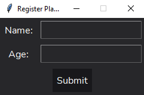
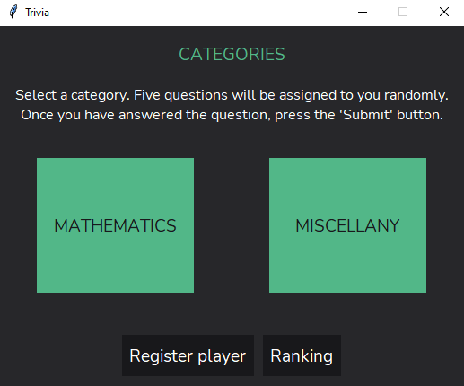
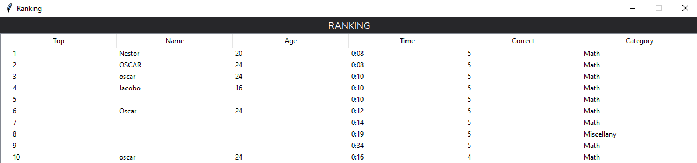
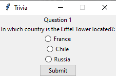
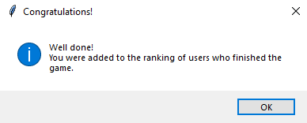

<h1 align="center" id="title">Quiz Game</h1>

<p align="center"></p>

<p id="description">Question and answer game, using a modular structure and databases for its construction.</p>

## Table of Contents

- [Demo](#demo)
- [Features](#features)
- [Installation Step](#installation-steps)
- [The process](#the-process)
  - [Built with](#built-with)
  - [Structure](#structure)
- [Useful resources](#useful-resources)
- [License](#license)
- [Author](#author)

## Demo






  
## Features

Here're some of the project's best features:

*   Demonstrating proficiency in Python.
*   Demonstrating proficiency in Modular Structures.
*   Demonstrating proficiency in Object Oriented Programming.

## Installation Steps:

1. Clone the repository.
2. Open the project with Visual Studio Code.
3. Run the app and enjoy it.

## The process 
### Built with

Technologies used in the project:

*   Python 3.9
*   Visual Studio Code 1.70.2

### Structure

``` Python
    class App:

        def __init__(self):
            self.root = Tk()
            self.root.title("Trivia")
            self.root.resizable(0,0)
            self.root.config( background= "#27272a")

            self.connection1 = Connection()

            self.functions = Functions()
            self.functions.register_player(self.root)

            self.categories_interface()

            self.root.mainloop()
```

## Useful resources

* [Python](https://www.python.org/) - High-level interpreted programming language whose philosophy emphasizes the readability of its code.
* [Visual Studio Code](https://code.visualstudio.com/) - Source code editor developed by Microsoft.

## License:

> This project is licensed under the MIT License

## Author

Made with 💚 by [R4cz](https://www.linkedin.com/in/r4cz/)
